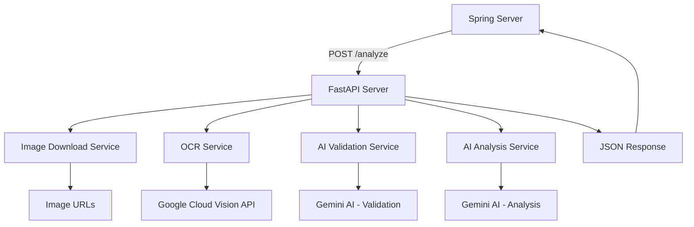
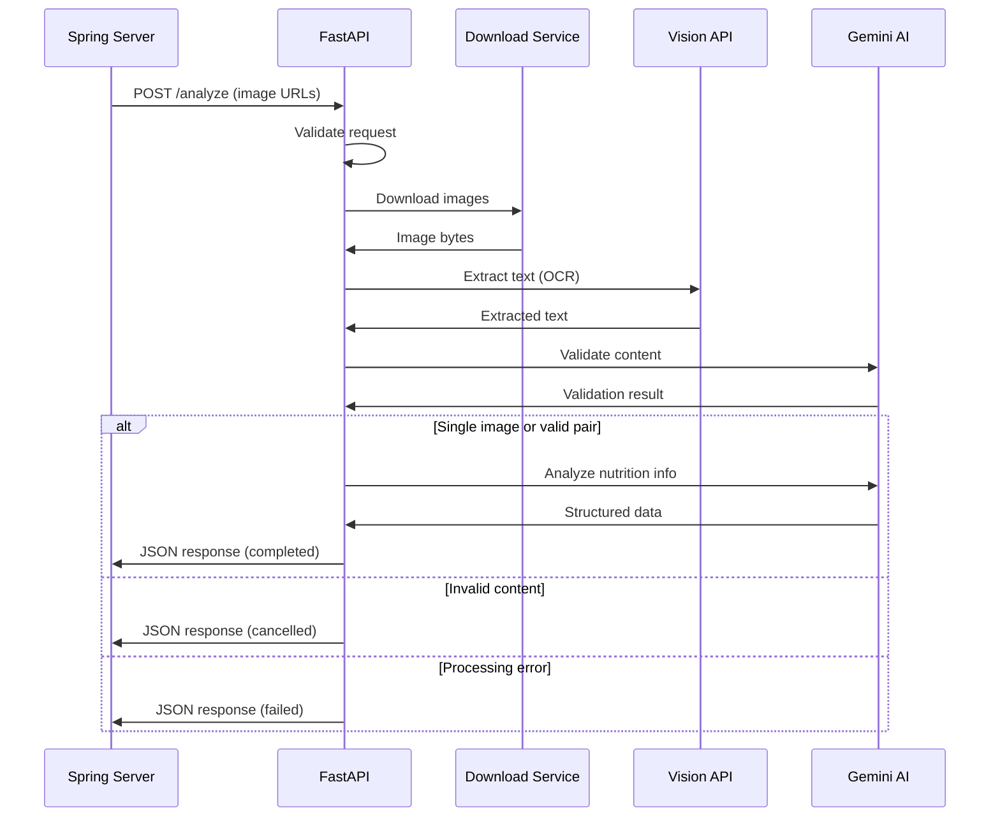

# 설계 문서

## 개요

이 설계는 기존 Python 영양성분표 분석 시스템을 FastAPI 기반 웹 서비스로 변환하는 것입니다. 시스템은 Spring 서버로부터 이미지 URL을 받아 Google Cloud Vision API와 Gemini AI를 사용하여 영양 정보를 분석하고, 구조화된 JSON 응답을 반환합니다. 시스템은 단일 이미지와 이중 이미지 시나리오를 모두 지원하며, 포괄적인 검증과 오류 처리를 제공합니다.

## 아키텍처

### 전체 시스템 아키텍처



### 요청 처리 플로우



## 컴포넌트 및 인터페이스

### 1. API 엔드포인트

#### POST /analyze
- **목적**: 이미지 URL을 받아 영양 정보를 분석
- **입력**: JSON 형식의 이미지 URL 리스트
- **출력**: 구조화된 영양 정보 JSON

```python
# 요청 모델
class AnalyzeRequest(BaseModel):
    image_urls: List[str] = Field(..., min_items=1, max_items=2)

# 응답 모델
class AnalyzeResponse(BaseModel):
    decodeStatus: str  # "completed", "cancelled", "failed"
    product_name: Optional[str]
    nutrition_info: Optional[Dict[str, Optional[str]]]
    ingredients: Optional[List[str]]
    message: Optional[str]
```

### 2. 서비스 컴포넌트

#### ImageDownloadService
- **책임**: URL에서 이미지 다운로드 및 검증
- **메서드**:
  - `download_image(url: str) -> bytes`: URL에서 이미지 다운로드
  - `validate_image_format(image_bytes: bytes) -> bool`: 이미지 형식 검증

#### OCRService
- **책임**: Google Cloud Vision API를 사용한 텍스트 추출
- **메서드**:
  - `extract_text(image_bytes: bytes) -> str`: 이미지에서 텍스트 추출

#### ValidationService
- **책임**: Gemini AI를 사용한 콘텐츠 검증
- **메서드**:
  - `validate_single_image(text: str) -> bool`: 단일 이미지 영양정보 검증
  - `validate_image_pair(text1: str, text2: str) -> bool`: 이미지 쌍 연관성 검증

#### AnalysisService
- **책임**: Gemini AI를 사용한 최종 영양정보 분석
- **메서드**:
  - `analyze_nutrition_info(text: str) -> dict`: 구조화된 영양정보 추출

### 3. 유틸리티 컴포넌트

#### ConfigManager
- **책임**: 환경 설정 관리
- **기능**:
  - Google Cloud 자격증명 로드
  - Gemini API 키 관리
  - 설정 검증

#### LoggingService
- **책임**: 구조화된 로깅
- **기능**:
  - 요청/응답 로깅
  - 오류 로깅
  - 성능 메트릭 로깅

## 데이터 모델

### 요청 데이터 모델

```python
class AnalyzeRequest(BaseModel):
    image_urls: List[str] = Field(
        ..., 
        min_items=1, 
        max_items=2,
        description="분석할 이미지 URL 리스트 (1-2개)"
    )
```

### 응답 데이터 모델

Spring 서버의 데이터베이스 구조에 맞춰 설계된 응답 모델:

```python
class NutritionInfo(BaseModel):
    calcium: Optional[str] = None          # 칼슘
    carbohydrate: Optional[str] = None     # 탄수화물
    cholesterol: Optional[str] = None      # 콜레스테롤
    dietary_fiber: Optional[str] = None    # 식이섬유
    energy: Optional[str] = None           # 칼로리
    fat: Optional[str] = None              # 지방
    protein: Optional[str] = None          # 단백질
    sat_fat: Optional[str] = None          # 포화지방
    sodium: Optional[str] = None           # 나트륨
    sugar: Optional[str] = None            # 당류
    trans_fat: Optional[str] = None        # 트랜스지방

class AnalyzeResponse(BaseModel):
    decodeStatus: str = Field(
        ..., 
        description="처리 상태: COMPLETED, CANCELLED, FAILED (Spring의 DecodeStatus enum과 일치)"
    )
    product_name: Optional[str] = Field(
        None, 
        description="제품명 (공백 제거, 한글/영문/숫자만)"
    )
    nutrition_info: Optional[NutritionInfo] = Field(
        None, 
        description="영양성분 정보 (Spring의 ProductNutrition 엔티티와 매핑)"
    )
    ingredients: Optional[List[str]] = Field(
        None, 
        description="원재료명 리스트 (Spring의 RawMaterial과 매핑)"
    )
    message: Optional[str] = Field(
        None, 
        description="상태 메시지"
    )
```

## 오류 처리

### 오류 분류 및 처리 전략

1. **입력 검증 오류** (HTTP 400)
   - 잘못된 URL 형식
   - 이미지 개수 초과/부족
   - 필수 필드 누락

2. **이미지 다운로드 오류** (HTTP 422)
   - URL 접근 불가
   - 잘못된 이미지 형식
   - 파일 크기 초과

3. **외부 API 오류** (HTTP 500)
   - Google Cloud Vision API 오류
   - Gemini AI API 오류
   - 네트워크 연결 오류

4. **비즈니스 로직 오류** (HTTP 200, decodeStatus: "CANCELLED" 또는 "FAILED")
   - 영양정보 관련 없는 이미지 (CANCELLED)
   - 이미지 품질 문제로 인한 분석 실패 (FAILED)
   - 서로 다른 제품의 이미지 (CANCELLED)

### 오류 응답 형식

Spring의 DecodeStatus enum과 일치하도록 설계:

```python
class ErrorResponse(BaseModel):
    decodeStatus: str = "FAILED"  # COMPLETED, CANCELLED, FAILED
    message: str
    product_name: Optional[str] = None
    nutrition_info: Optional[NutritionInfo] = None
    ingredients: Optional[List[str]] = None
```

## 테스트 전략

### 단위 테스트
- 각 서비스 컴포넌트별 독립 테스트
- Mock을 사용한 외부 API 의존성 제거
- 다양한 입력 시나리오 테스트

### 통합 테스트
- 전체 API 엔드포인트 테스트
- 실제 이미지 URL을 사용한 E2E 테스트
- 오류 시나리오 테스트

### 테스트 데이터
- 유효한 영양성분표 이미지 URL
- 관련 없는 이미지 URL
- 품질이 낮은 이미지 URL
- 서로 다른 제품의 이미지 URL 쌍

### 성능 테스트
- 동시 요청 처리 능력 테스트
- 이미지 크기별 처리 시간 측정
- 메모리 사용량 모니터링

## 보안 고려사항

### 입력 검증
- URL 형식 검증
- 허용된 도메인 제한 (선택사항)
- 이미지 파일 크기 제한
- 요청 빈도 제한 (Rate Limiting)

### 데이터 보호
- 다운로드된 이미지의 임시 저장 및 자동 삭제
- API 키 환경변수 관리
- 로그에서 민감 정보 제외

### API 보안
- CORS 설정
- 요청 크기 제한
- 타임아웃 설정

## 배포 및 운영

### 환경 설정
- Docker 컨테이너화
- 환경변수 기반 설정 관리
- Health check 엔드포인트 제공

### 모니터링
- 구조화된 로깅
- 메트릭 수집 (처리 시간, 성공률 등)
- 알림 설정

### 확장성
- 비동기 처리를 통한 동시성 지원
- 외부 API 호출 최적화
- 캐싱 전략 (선택사항)