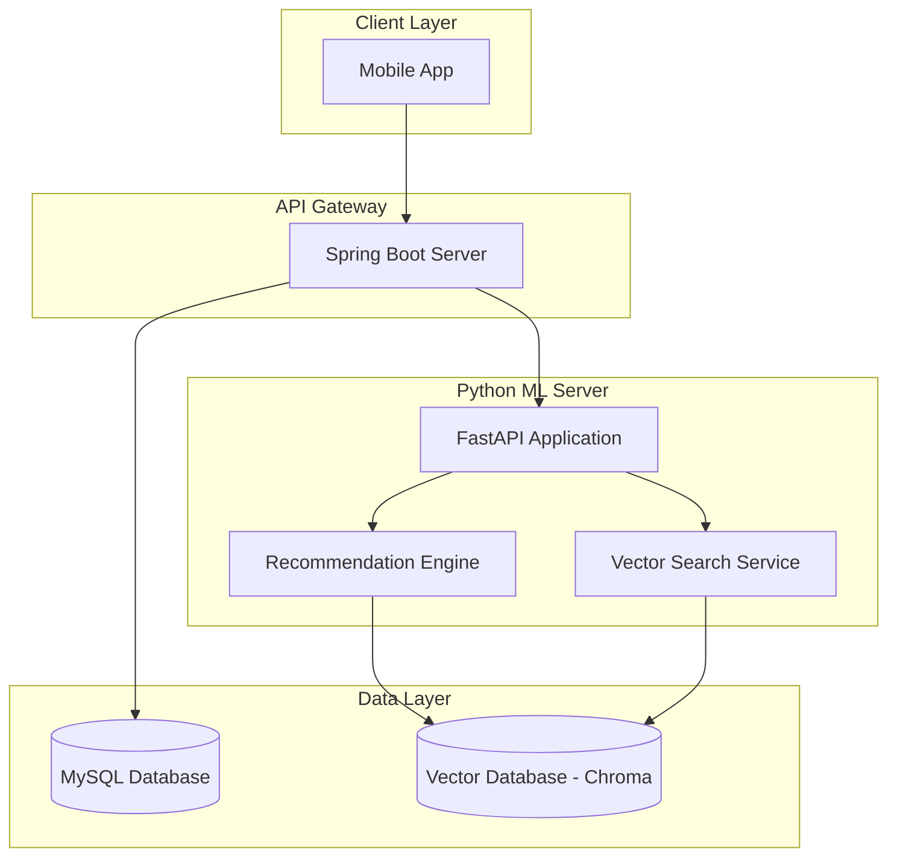
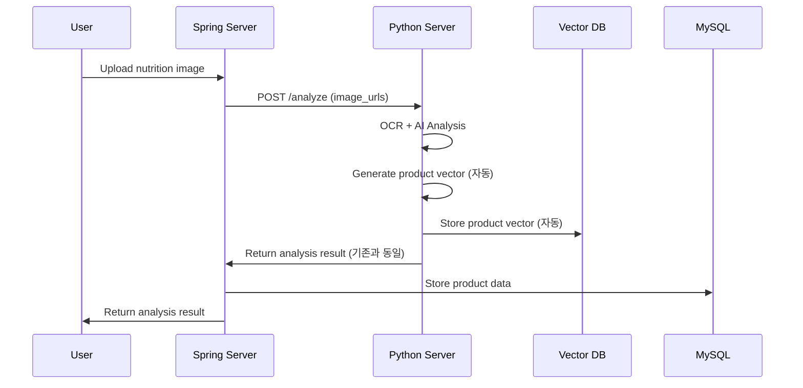
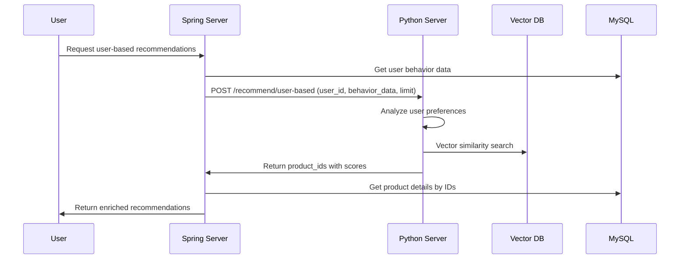
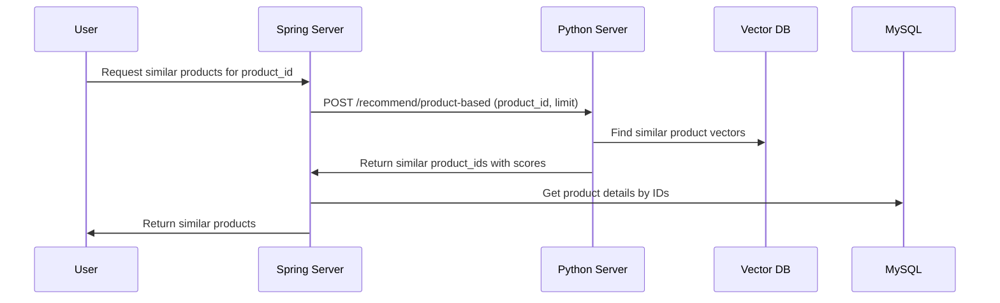

# Design Document

## Overview

MSA 구조에서 파이썬 서버는 머신러닝 기반 추천 시스템의 핵심 역할을 담당합니다. 스프링 서버가 모든 데이터베이스 접근을 담당하고, 파이썬 서버는 순수하게 ML 연산만 처리하는 stateless 서비스로 동작합니다.

## System Architecture



## Data Flow

### 1. 제품 분석 및 벡터 생성 플로우 (기존 확장)


### 2. 사용자 행동 기반 추천 플로우


### 3. 제품 기반 유사 제품 추천 플로우


## Technology Stack

### Python ML Server
- **FastAPI**: REST API 서버
- **ChromaDB**: 벡터 데이터베이스 (제품 임베딩 저장)
- **sentence-transformers**: 텍스트 임베딩 생성 (한국어 지원)
- **scikit-learn**: 협업 필터링 및 추천 알고리즘

### Spring Server (기존)
- **MySQL**: 사용자 데이터, 제품 정보, 행동 데이터 저장
- **JPA**: 데이터베이스 ORM

## Database Schema

### MySQL (Spring Server에서 관리)

#### 사용자 행동 데이터 테이블

```sql
-- Spring Entity 기반 테이블
CREATE TABLE user_behavior (
    id BIGINT AUTO_INCREMENT PRIMARY KEY,
    user_id BIGINT NOT NULL,
    product_id BIGINT NOT NULL,
    behavior ENUM('VIEW', 'LIKE', 'REGISTER', 'SEARCH') NOT NULL,
    created_at DATETIME(6) NOT NULL,
    updated_at DATETIME(6) NOT NULL,
    FOREIGN KEY (user_id) REFERENCES users(id),
    FOREIGN KEY (product_id) REFERENCES product(product_id)
);
```

**추천 가중치:**
- REGISTER: 5점 (직접 등록 = 가장 강한 관심)
- LIKE: 3점 (좋아요 = 선호)
- SEARCH: 2점 (검색 = 관심)
- VIEW: 1점 (조회 = 기본 관심)

### Vector Database (Python Server에서 관리)

#### ChromaDB Collections

**product_vectors**
- **용도**: 제품 유사도 검색
- **차원**: 384차원 (sentence-transformer)
- **메타데이터**:
  ```json
  {
    "product_id": 123,
    "product_name": "곰곰 육개장",
    "energy": 160.0,
    "protein": 10.5,
    "main_ingredients": ["beef", "water", "vegetables"]
  }
  ```

## API Specification

### 1. 사용자 행동 기반 추천 API

**Endpoint**: `POST /api/v1/recommend/user-based`

**Request**:
```json
{
  "user_id": 123,
  "behavior_data": [
    {
      "product_id": 456,
      "behavior_type": "VIEW",
      "timestamp": "2024-01-01T10:00:00Z"
    },
    {
      "product_id": 789,
      "behavior_type": "LIKE",
      "timestamp": "2024-01-01T11:00:00Z"
    }
  ],
  "limit": 20
}
```

**Response**:
```json
{
  "recommendations": [
    {
      "product_id": 789,
      "similarity_score": 0.85,
      "recommendation_reason": "사용자가 좋아요한 제품과 유사한 영양성분"
    }
  ]
}
```

### 2. 특정 제품 기반 유사 제품 추천 API

**Endpoint**: `POST /api/v1/recommend/product-based`

**Request**:
```json
{
  "product_id": 123,
  "limit": 15
}
```

**Response**:
```json
{
  "recommendations": [
    {
      "product_id": 456,
      "similarity_score": 0.92,
      "recommendation_reason": "영양성분과 원재료가 매우 유사"
    }
  ]
}
```

### 3. 제품 벡터 자동 생성 (내부 처리)

**기존 상품 분석 API 확장**: `POST /api/v1/analyze`

상품 분석이 성공적으로 완료되면 자동으로 벡터 생성 및 저장:

1. 기존 OCR + AI 분석 완료
2. 분석 결과 반환 (기존과 동일)
3. **추가**: 분석 결과를 사용하여 자동으로 벡터 생성 및 ChromaDB 저장

**내부 벡터 생성 로직**:
- 영양성분 정보 + 원재료 정보 → 텍스트 변환 → 384차원 벡터
- ChromaDB에 product_id와 함께 저장
- 별도 API 호출 불필요

## Deployment

### Docker Configuration

```yaml
# docker-compose.yml
version: '3.8'
services:
  python-ml-server:
    build: .
    ports:
      - "8001:8001"
    environment:
      - CHROMA_HOST=chroma
    depends_on:
      - chroma
  
  chroma:
    image: chromadb/chroma:latest
    ports:
      - "8000:8000"
    volumes:
      - chroma_data:/chroma/chroma

volumes:
  chroma_data:
```

## Performance Targets

- **추천 응답 시간**: 3초 이내
- **벡터 검색 성능**: 100ms 이내
- **벡터 차원**: 384차원 (성능과 정확도 균형)