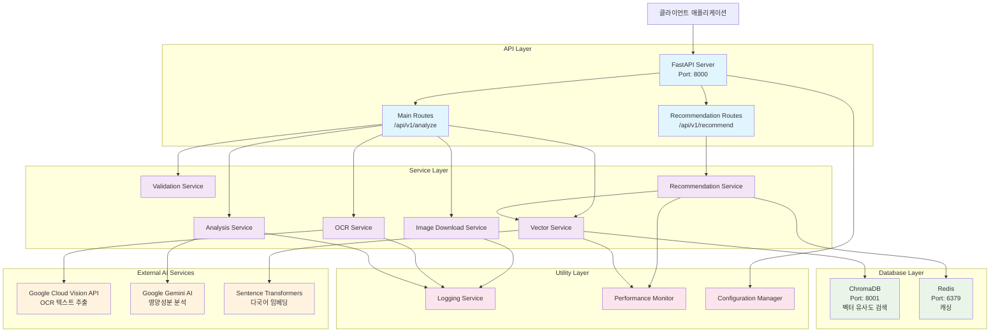
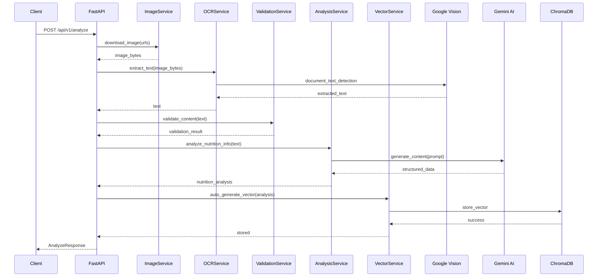
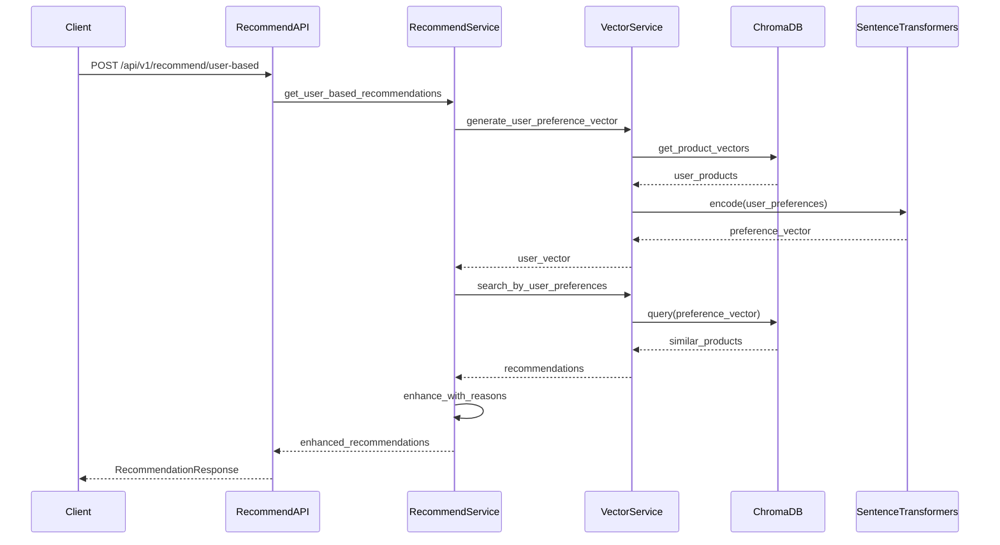
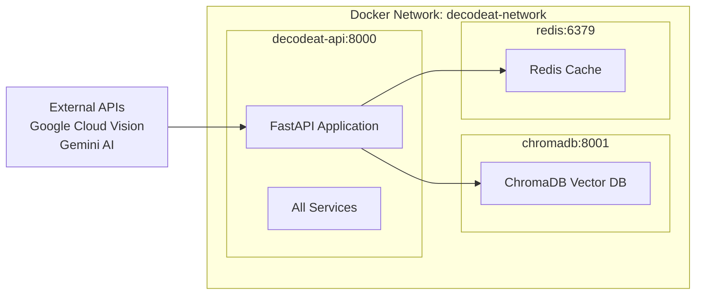
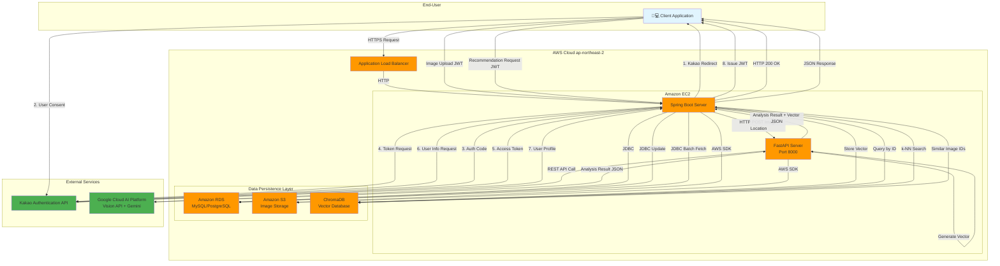

# DecodeAt 시스템 아키텍처

## 기술 스택

### 백엔드 프레임워크
- **FastAPI**: 메인 웹 프레임워크
- **Python 3.11**: 런타임 환경
- **Uvicorn**: ASGI 서버

### AI/ML 서비스
- **Google Cloud Vision API**: OCR 텍스트 추출
- **Google Gemini AI**: 영양성분 분석
- **Sentence Transformers**: 다국어 임베딩 생성
- **ChromaDB**: 벡터 데이터베이스

### 데이터베이스 및 캐싱
- **ChromaDB**: 벡터 유사도 검색
- **Redis**: 캐싱 (선택적)

### 컨테이너화
- **Docker**: 애플리케이션 컨테이너화
- **Docker Compose**: 멀티 컨테이너 오케스트레이션

## 시스템 아키텍처

## 영양성분 분석 플로우

## 추천 시스템 플로우

## Docker 컨테이너 구성

## 핵심 아키텍처 특징

### 1. 마이크로서비스 지향 설계
- 각 기능별로 독립적인 서비스 클래스
- 의존성 주입을 통한 느슨한 결합
- 비동기 처리로 성능 최적화

### 2. AI 서비스 통합
- Google Cloud Vision API로 OCR 처리
- Gemini AI로 구조화된 영양성분 분석
- Sentence Transformers로 다국어 임베딩 생성

### 3. 벡터 기반 추천 시스템
- ChromaDB를 활용한 벡터 유사도 검색
- 사용자 행동 기반 개인화 추천
- 제품 간 유사도 기반 추천

### 4. 컨테이너 기반 배포
- Docker Compose로 멀티 컨테이너 관리
- 서비스별 독립적인 스케일링 가능
- 헬스체크 및 자동 재시작 지원

### 5. 성능 최적화
- 비동기 처리로 동시성 향상
- 캐싱 레이어로 응답 속도 개선
- 성능 모니터링 및 측정

## 전체 시스템 아키텍처 (AWS 배포)

