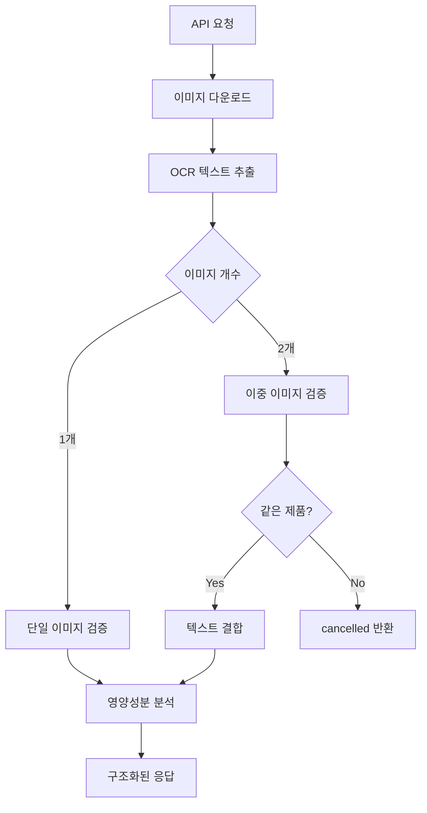

# Nutrition Label Analysis API

FastAPI 기반의 영양성분표 분석 API 서비스입니다. 이미지 URL을 입력받아 Google Cloud Vision API와 Gemini AI를 사용하여 영양성분 정보를 추출하고 구조화된 데이터로 반환합니다.

## 📋 목차

- [프로젝트 개요](#프로젝트-개요)
- [주요 기능](#주요-기능)
- [프로젝트 구조](#프로젝트-구조)
- [설치 및 설정](#설치-및-설정)
- [실행 방법](#실행-방법)
- [API 문서](#api-문서)
- [서비스 아키텍처](#서비스-아키텍처)
- [개발 가이드](#개발-가이드)
- [테스트](#테스트)
- [트러블슈팅](#트러블슈팅)

## 🎯 프로젝트 개요

### 목적
식품 포장지의 영양성분표와 원재료 정보를 이미지에서 자동으로 추출하여 구조화된 데이터로 제공하는 API 서비스

### 주요 기술 스택
- **Backend Framework**: FastAPI
- **OCR**: Google Cloud Vision API
- **AI Analysis**: Google Gemini AI
- **Image Processing**: PIL (Python Imaging Library)
- **HTTP Client**: httpx (비동기)
- **Testing**: pytest
- **Configuration**: pydantic-settings

## ✨ 주요 기능

### 1. 이미지 분석
- 1개 또는 2개의 이미지 URL 처리
- 영양성분표 및 원재료 정보 추출
- 이미지 품질 및 내용 검증

### 2. 데이터 구조화
- 영양성분 정보를 표준화된 형식으로 변환
- 제품명 정규화 (공백 제거, 한글/영문/숫자만 유지)
- 원재료 목록 파싱

### 3. 상태 관리
- `completed`: 성공적인 분석
- `cancelled`: 영양성분 정보 없음 또는 다른 제품
- `failed`: 기술적 오류 또는 이미지 품질 불량

## 📁 프로젝트 구조

```
nutrition-label-api/
├── decodeat/                          # 메인 패키지
│   ├── __init__.py
│   ├── main.py                        # FastAPI 애플리케이션 진입점
│   ├── config.py                      # 설정 관리
│   │
│   ├── api/                           # API 관련 모듈
│   │   ├── __init__.py
│   │   ├── models.py                  # Pydantic 모델 (요청/응답)
│   │   └── routes.py                  # API 라우트 핸들러
│   │
│   ├── services/                      # 비즈니스 로직 서비스
│   │   ├── __init__.py
│   │   ├── image_download_service.py  # 이미지 다운로드 및 검증
│   │   ├── ocr_service.py            # Google Cloud Vision OCR
│   │   ├── validation_service.py      # Gemini AI 내용 검증
│   │   └── analysis_service.py        # Gemini AI 영양성분 분석
│   │
│   └── utils/                         # 유틸리티 모듈
│       ├── __init__.py
│       └── logging.py                 # 구조화된 로깅
│
├── tests/                             # 테스트 코드
│   ├── test_api_routes.py            # API 엔드포인트 테스트
│   ├── test_image_download_service.py # 이미지 다운로드 테스트
│   ├── test_ocr_service.py           # OCR 서비스 테스트
│   ├── test_validation_service.py     # 검증 서비스 테스트
│   └── test_analysis_service.py       # 분석 서비스 테스트
│
├── .kiro/specs/nutrition-label-api/   # 프로젝트 명세서
│   ├── requirements.md               # 요구사항 문서
│   ├── design.md                     # 설계 문서
│   └── tasks.md                      # 구현 태스크
│
├── examples/                          # 예제 코드
│   └── validation_demo.py            # 검증 서비스 데모
│
├── requirements.txt                   # Python 의존성
├── .env                              # 환경 변수 (로컬)
├── .env.example                      # 환경 변수 예제
├── gcp-key.json                      # Google Cloud 인증 키
├── run_server.py                     # 서버 실행 스크립트
├── test_full_api.py                  # 전체 API 테스트 스크립트
└── README.md                         # 프로젝트 문서
```

## 🛠 설치 및 설정

### 1. 의존성 설치

```bash
# Python 가상환경 생성 (권장)
python -m venv .venv
source .venv/bin/activate  # Linux/Mac
# 또는
.venv\Scripts\activate     # Windows

# 의존성 설치
pip install -r requirements.txt
```

### 2. 환경 변수 설정

`.env` 파일을 생성하고 다음 내용을 설정:

```env
# Gemini AI API Key (필수)
GEMINI_API_KEY=your_gemini_api_key_here

# 서버 설정 (선택사항)
DEBUG=true
HOST=0.0.0.0
PORT=8000
```

### 3. Google Cloud 인증 설정

Google Cloud Vision API 사용을 위한 서비스 계정 키 파일을 `gcp-key.json`으로 저장하거나 환경 변수로 설정:

```bash
export GOOGLE_APPLICATION_CREDENTIALS="$(pwd)/gcp-key.json"
```

## 🚀 실행 방법

### 방법 1: 직접 실행

```bash
# 환경 변수 설정
export GOOGLE_APPLICATION_CREDENTIALS="$(pwd)/gcp-key.json"

# 서버 실행
python -m decodeat.main
```

### 방법 2: 실행 스크립트 사용

```bash
# 서버 실행
python run_server.py
```

### 서버 실행 확인

서버가 성공적으로 시작되면 다음 URL들에 접근할 수 있습니다:

- **API 문서**: http://localhost:8000/docs
- **헬스체크**: http://localhost:8000/health
- **API 엔드포인트**: http://localhost:8000/api/v1/analyze

## 📚 API 문서

### POST /api/v1/analyze

영양성분표 이미지를 분석하여 구조화된 데이터를 반환합니다.

#### 요청 (Request)

```json
{
  "image_urls": [
    "https://example.com/nutrition-label.jpg"
  ]
}
```

**Parameters:**
- `image_urls` (array): 분석할 이미지 URL 목록 (1-2개)

#### 응답 (Response)

```json
{
  "decodeStatus": "completed",
  "product_name": "육개장",
  "nutrition_info": {
    "energy": "160",
    "carbohydrate": "4",
    "protein": "10.5",
    "fat": "11.1",
    "sodium": "2781",
    "sugar": "1.4",
    "sat_fat": "4.4",
    "trans_fat": "0",
    "cholesterol": "75",
    "calcium": null,
    "dietary_fiber": null
  },
  "ingredients": [
    "정제수",
    "토란대(미얀마산)",
    "쇠고기(외국산:호주, 미국, 뉴질랜드 등)"
  ],
  "message": "Analysis completed successfully"
}
```

#### 상태 코드

- `200`: 성공
- `422`: 요청 데이터 검증 오류
- `500`: 서버 내부 오류

#### decodeStatus 값

- `completed`: 분석 성공
- `cancelled`: 영양성분 정보 없음 또는 서로 다른 제품
- `failed`: 기술적 오류 또는 이미지 품질 불량

### GET /health

서비스 상태를 확인합니다.

#### 응답

```json
{
  "status": "healthy",
  "service": "nutrition-label-api",
  "version": "1.0.0"
}
```

## 🏗 서비스 아키텍처

### 처리 플로우



### 서비스 계층

#### 1. ImageDownloadService
- **목적**: 이미지 URL에서 이미지 다운로드 및 검증
- **주요 기능**:
  - URL 유효성 검사
  - 이미지 형식 및 크기 검증
  - Content-Type 및 파일 확장자 기반 검증
  - 비동기 다운로드 지원

#### 2. OCRService
- **목적**: Google Cloud Vision API를 사용한 텍스트 추출
- **주요 기능**:
  - 이미지에서 텍스트 추출
  - 비동기 처리 지원
  - 오류 처리 및 재시도 로직

#### 3. ValidationService
- **목적**: Gemini AI를 사용한 내용 검증
- **주요 기능**:
  - 단일 이미지 영양성분 정보 포함 여부 검증
  - 이중 이미지 동일 제품 여부 검증
  - 한국어 특화 검증 로직

#### 4. AnalysisService
- **목적**: Gemini AI를 사용한 영양성분 분석
- **주요 기능**:
  - 텍스트에서 구조화된 영양성분 정보 추출
  - 제품명 정규화
  - 원재료 목록 파싱
  - 분석 품질 평가

## 👨‍💻 개발 가이드

### 코드 스타일

- **Python**: PEP 8 준수
- **Docstring**: Google 스타일
- **Type Hints**: 모든 함수에 타입 힌트 사용
- **Async/Await**: 비동기 처리 적극 활용

### 새로운 서비스 추가

1. `decodeat/services/` 디렉토리에 새 서비스 파일 생성
2. 서비스 클래스 구현 (비동기 메서드 권장)
3. `tests/` 디렉토리에 테스트 파일 추가
4. API 라우트에서 서비스 사용

### 환경 설정 추가

1. `decodeat/config.py`의 `Settings` 클래스에 새 설정 추가
2. `.env.example` 파일에 예제 값 추가
3. 문서 업데이트

### 로깅

구조화된 JSON 로깅을 사용합니다:

```python
from decodeat.utils.logging import LoggingService

logger = LoggingService(__name__)
logger.info("메시지", extra_data={"key": "value"})
```

## 🧪 테스트

### 전체 테스트 실행

```bash
# 모든 테스트 실행
python -m pytest

# 특정 테스트 파일 실행
python -m pytest tests/test_api_routes.py

# 커버리지와 함께 실행
python -m pytest --cov=decodeat
```

### API 테스트

```bash
# 서버 실행 (별도 터미널)
python run_server.py

# API 테스트 실행
python test_full_api.py
```

### 개별 서비스 테스트

```bash
# 이미지 다운로드 테스트
python -m pytest tests/test_image_download_service.py -v

# OCR 서비스 테스트
python -m pytest tests/test_ocr_service.py -v

# 검증 서비스 테스트
python -m pytest tests/test_validation_service.py -v

# 분석 서비스 테스트
python -m pytest tests/test_analysis_service.py -v
```

## 🔧 트러블슈팅

### 일반적인 문제들

#### 1. Google Cloud Vision API 인증 오류

**증상**: `DefaultCredentialsError: File was not found`

**해결방법**:
```bash
# 환경 변수 설정 확인
export GOOGLE_APPLICATION_CREDENTIALS="$(pwd)/gcp-key.json"

# 파일 존재 확인
ls -la gcp-key.json
```

#### 2. Gemini API 키 오류

**증상**: `GEMINI_API_KEY is required`

**해결방법**:
```bash
# .env 파일에 API 키 설정
echo "GEMINI_API_KEY=your_api_key_here" >> .env
```

#### 3. 이미지 다운로드 실패

**증상**: `URL does not point to an image. Content-Type: application/octet-stream`

**해결방법**: 
- S3 등에서 올바른 Content-Type 설정
- 현재 코드는 파일 확장자 기반 검증도 지원

#### 4. 포트 충돌

**증상**: `Port 8000 is busy`

**해결방법**: 
- 자동으로 다른 포트 찾음
- 또는 `.env`에서 `PORT=8001` 설정

### 디버깅

#### 로그 레벨 조정

```bash
# 디버그 모드 활성화
export DEBUG=true
```

#### 개별 서비스 테스트

각 서비스를 개별적으로 테스트하여 문제 지점 파악:

```python
# 예: OCR 서비스만 테스트
import asyncio
from decodeat.services.ocr_service import OCRService

async def test_ocr():
    async with OCRService() as service:
        # 테스트 코드
        pass

asyncio.run(test_ocr())
```

## 📝 추가 정보

### 성능 최적화

- 이미지 다운로드: 동시 처리 지원
- OCR 처리: 스레드 풀 사용
- API 응답: 비동기 처리로 높은 처리량

### 보안 고려사항

- API 키는 환경 변수로 관리
- 이미지 크기 제한 (10MB)
- URL 검증 및 타임아웃 설정

### 확장성

- 마이크로서비스 아키텍처 적용 가능
- 각 서비스는 독립적으로 스케일링 가능
- 캐싱 레이어 추가 가능

---

## 📞 지원

문제가 발생하거나 기능 개선 제안이 있으시면 이슈를 등록해주세요.

**개발팀**: Decodeat Backend Team  
**버전**: 1.0.0  
**최종 업데이트**: 2025년 9월 10일